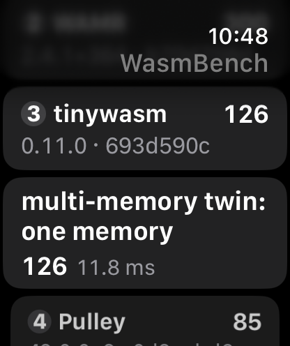

# tinywasm on the Apple Watch Series 10 (2026-09-26)

tinywasm ranks near the bottom of the WasmBench leaderboard on an Apple
Watch Series 10. This report measures why, and what to change.

- **The gap is instruction count, not stalls.** Across 28 rows, tinywasm
  needs 1.90× WAMR's cycles per call on the watch. It retires 2.37× the
  instructions, at a higher IPC (3.22 against 2.58).
- **The watch is not special.** The iPhone 16 Pro Max shows the same gap
  on its efficiency cores (1.95×). Its performance cores hide some of it
  with IPC 6.6, but tinywasm still needs 1.71× WAMR's cycles there.
- **Mispredicts and cache misses are negligible** on tinywasm's worst
  row. On an A18 Pro efficiency core, 80.6% of cycles retire useful
  work, 0.15% are discarded speculation and 0.5% are front-end stalls.
  Each dispatched Wasm op costs about 47 machine instructions, against
  about 14 per WAMR op.
- **A fix is staged in the fork:** memory handlers no longer carry the
  shared-memory lock path inline. On the watch this cuts retired
  instructions by 4–6% and cycles by 5–9% on memory-heavy rows, with no
  change on rows without memory traffic.

## Where tinywasm trails WAMR on the watch

Harness launches (`BENCH_TARGET_MS=200`, one engine per launch). Cycles
and instructions per call come from the kernel's fixed counters for the
timed window.

| row | tinywasm ÷ WAMR, cycles | ÷ WAMR, instructions | tinywasm IPC | WAMR IPC |
|---|---:|---:|---:|---:|
| relaxed-SIMD FMA Horner (16K pts) | 2.83× | 2.99× | 3.18 | 3.02 |
| **multi-memory twin: one memory** | **2.72×** | **3.97×** | 3.89 | 2.66 |
| matmul relaxed-simd FMA | 2.58× | 2.66× | 3.18 | 3.08 |
| graphql-validation (AS) | 2.58× | 3.91× | 2.86 | 1.89 |
| crc32(64KB) | 2.44× | 3.41× | 3.43 | 2.45 |
| geomean, 28 rows | 1.90× | 2.37× | 3.22 | 2.58 |

The two relaxed-SIMD rows have a separate cause: tinywasm's v128 ops are
portable Rust on aarch64. The analysis below uses the worst scalar row,
"multi-memory twin: one memory", a byte-hash loop in which every op is
cheap.

| device | cycles ÷ WAMR | instructions ÷ WAMR | tinywasm IPC | WAMR IPC | on E-cores |
|---|---:|---:|---:|---:|---:|
| Apple Watch Series 10 | 1.90× | 2.37× | 3.22 | 2.58 | 1.00 |
| iPhone 16 Pro Max, efficiency cores | 1.95× | 2.21× | 3.49 | 3.08 | 0.90 |
| iPhone 16 Pro Max, performance cores | 1.71× | 2.26× | 6.60 | 5.03 | 0.01 |

## CPU counters on the worst row

Instruments cannot read CPU counters on the watch: the guided counter
modes cover t8101–t8160 but not the S10's t8310, and a capture there
records no counter tables. The capture below comes from the iPhone 16 Pro
Max efficiency cores (A18 Pro, t8140), where tinywasm behaves as it does
on the watch. It is tinywasm only, 8 s per mode, inside a 30 s timed
window, so the warmup is a few percent of each capture.

| metric (benchmark thread) | value |
|---|---|
| cycles retiring useful work | 80.6% |
| back-end stalls | 18.8%: execution latency; memory misses are 2% of it |
| front-end stalls (i-cache, i-TLB, fetch bandwidth) | 0.5% |
| discarded speculation (mispredicts) | 0.15% |
| L1D load miss rate | 0.05% of loads |
| loads per instruction | 0.35 |
| indirect branches per call | 1.70 M for 1.25 M dispatched ops |
| machine instructions per dispatched op (watch counters) | ~47; WAMR ~14 per IR op |

tinywasm lowers the pass-1 loop to 13 ops and pass 2 to 6, both well
fused (`tinywasm dump`). WAMR's register IR runs about 11 and 5. The op
counts are close; the gap is the cost per op.

The extra 0.45 M indirect branches come from generic fused ops such as
`BinOpStackConst32(Rotl, 5)`. Each one switches on its operator, a second
indirect jump per op.

In the Time Profiler capture, 51% of the samples fall in value-stack
plumbing: `set` 24%, `capacity` 19%, `pop` 5%, `index` 3%. The stack
lives in the `Store`, so every push or pop loads the stack pointer,
length and capacity from memory and writes the length back.

`LocalSet32` shows the fixed cost per op: 31 instructions for a
3-instruction move.

| part | instructions |
|---|---:|
| frame record (cold paths `bl` to panics) | 3 |
| re-check of the opcode the dispatch table already chose | 3 |
| stack length load, underflow check, store | 5 |
| local index decode and bounds check | 5 |
| the move | 3 |
| next instruction: reload the function `Arc`, slice pointer and length, bounds check, load | 7 |
| dispatch: table address, opcode mask, handler load, frame pop, `br` | 6 |

Memory handlers cost more. Since the threads merge (#60), `with_memory!`
locks a shared memory inline. So every `I32Load`, `I32Store`, … handler
contains the lock and unlock calls and saves five register pairs on every
access, whether or not the memory is shared.

## Fix staged in the fork: shared-memory locking out of line

[rebeckerspecialties/tinywasm#10](https://github.com/rebeckerspecialties/tinywasm/pull/10)
(`perf/cold-shared-memory`, on upstream `next` `693d590c`) runs the
shared-memory body in a cold, out-of-line helper. The ordinary-memory
path stays inline. `I32Store` drops from 188 to 137 instructions of code
and from five saved register pairs to three.

The table below is the A/B on the watch: three interleaved installs of
each build, with tinywasm on the worst row, the five scalar-build rows,
xmrsplayer, graphql-validation and two controls. Values are medians of
the three runs, per call.

| row | instructions, before → after | instructions | cycles |
|---|---|---:|---:|
| **multi-memory twin: one memory** | 59.24 → 56.49 M | **−4.6%** | **−8.6%** |
| convolution 256×256 [scalar build] | 125.03 → 117.75 M | −5.8% | −4.8% |
| sieve(10000) [scalar build] | 6.27 → 6.01 M | −4.2% | −8.3% |
| crc32(64KB) [scalar build] | 45.85 → 44.04 M | −4.0% | −6.2% |
| call_indirect (200K dispatches) | 173.14 → 167.24 M | −3.4% | −5.9% |
| graphql-validation (AS) | 83.73 → 80.94 M | −3.3% | −2.8% |
| xmrsplayer (1024-frame buffer) | 117.30 → 113.87 M | −2.9% | −3.6% |
| bulk_memory [scalar build] | 97.02 → 95.92 M | −1.1% | −3.1% |
| fib(30) (no memory ops) | 887.95 → 886.28 M | −0.2% | −0.0% |
| call_ref twin (no memory ops in the loop) | 134.55 → 134.52 M | −0.0% | −0.3% |
| geomean, 10 rows | | −3.0% | −4.4% |

`factorial(20)` is left out because each call takes about 1 µs, too short
for the counters. A single one-second run's wall time on the watch varies
more than these deltas: in a matched pair of runs the baseline measured
11.8 ms and the change 12.4 ms. The counters are the comparison.

## Action plan

| # | change | owner | evidence | status |
|---|---|---|---|---|
| 1 | Shared-memory locking out of line | us, within the maintainer's rules (safe; cold path out of line, like #57–#59) | −4.6% instructions, −8.6% cycles on the worst row | fork PR #10 |
| 2 | Borrow the instruction stream across tail dispatch (saves the function `Arc` reload, 7 of 31 instructions in `LocalSet32`) | us | −7.2% cycles on A14, −6.8% on A12 | upstream draft #64 (fork #8); not yet measured on the watch |
| 3 | Keep the value-stack pointer and length in registers across handlers (51% of samples) | maintainer (`exp/acc` accumulator work) | profile above | discussion draft: ask whether `exp/acc` carries the stack pointer; offer watch measurements of `exp/acc` |
| 4 | Memory operand offsets in the instruction (side-pool `resolve`) | maintainer (planned u16 memory index; our #63 was closed) | ~2.3% of samples | wait for the maintainer |
| 5 | Specialized const ops for the hot operators (`Shl`, `Rotl`, `Mul`), avoiding the second indirect branch | maintainer's call (more variants versus the generic `BinOp*` ops) | 0.45 M extra indirect branches per call on the worst row | discussion draft |
| 6 | Handler overhead: opcode re-check and the frame record forced by cold panics | maintainer (instruction representation) | 6 of 31 instructions in `LocalSet32` | discussion draft |
| 7 | aarch64 SIMD for v128 ops (the relaxed-SIMD rows, 2.6–2.8×) | maintainer's call (would need an opt-in like `simd-x86`) | table above | later |

The discussion draft and the reduced example
([`reduced.wat`](tinywasm-watch-2026-09-26/reduced.wat)) are for Matt to
post: tinywasm's CONTRIBUTING asks for text written by the contributor.

## Method

- **Builds:** WasmBench Release builds. tinywasm `next` `2e469af5` for the
  suite runs and the counter capture; `693d590c` (parser limits only
  since) for the A/B. WAMR `b70d708d` with the relaxed-SIMD and PROT_NONE
  patches.
- **Counters:** instructions and cycles are the process's fixed counters
  (`task_info`) over the timed window. They include the app's other
  threads, which is noise of about 1% on short rows.
- **Data:** raw console lines are under
  [`tinywasm-watch-2026-09-26/`](tinywasm-watch-2026-09-26/).
  - `watch-suite/`, `iphone16-e-cores/` and `iphone16-p-cores/`: per-row
    result lines.
  - `ab/`: the A/B reps.
  - `pmu/`: the guided-mode counter summaries (`pmu.jsonl`) and the Time
    Profiler histogram.
