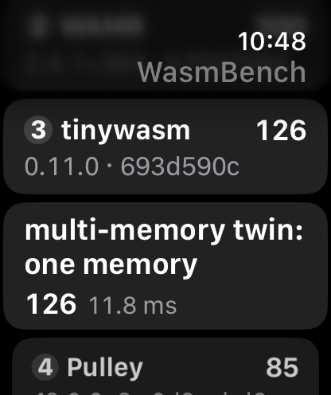

# tinywasm on the Apple Watch Series 10 (2026-09-26)

tinywasm ranks near the bottom of the WasmBench leaderboard on an Apple
Watch Series 10. This report measures why, and what to change.

- **The gap is instruction count, not stalls.** Across 28 rows, tinywasm
  needs 1.90× WAMR's cycles per call on the watch. It retires 2.37× the
  instructions, at a higher IPC (3.22 against 2.58).
- **The watch is not special.** The iPhone 16 Pro Max shows the same gap
  on its efficiency cores (1.95×). Its performance cores hide some of it
  with IPC 6.6, but tinywasm still needs 1.71× WAMR's cycles there.
- **Mispredicts and cache misses are negligible** on tinywasm's worst
  row. On an A18 Pro efficiency core, 80.6% of cycles retire useful
  work, 0.15% are discarded speculation and 0.5% are front-end stalls.
  Each dispatched Wasm op costs about 47 machine instructions, against
  about 14 per WAMR op.
- **A fix is staged in the fork:** memory handlers no longer carry the
  shared-memory lock path inline. On the watch this cuts retired
  instructions by 4–6% and cycles by 5–9% on memory-heavy rows, with no
  change on rows without memory traffic.
- **With the two PRs in review** (#64 and #72), tinywasm needs 8.8% fewer
  cycles on the iPhone 12's efficiency cores. What remains on xmrsplayer is
  fixed cost per op and per call; the [updated plan](#action-plan) ranks
  the next changes.
- **Cheaper calls** (plan item 2, fork #11 and #12) take the total to
  −14 to −17% cycles against `next` on three iPhones, every row faster;
  xmrsplayer −16 to −20%.

## Where tinywasm trails WAMR on the watch

Harness launches (`BENCH_TARGET_MS=200`, one engine per launch). Cycles
and instructions per call come from the kernel's fixed counters for the
timed window.

| row | tinywasm ÷ WAMR, cycles | ÷ WAMR, instructions | tinywasm IPC | WAMR IPC |
|---|---:|---:|---:|---:|
| relaxed-SIMD FMA Horner (16K pts) | 2.83× | 2.99× | 3.18 | 3.02 |
| **multi-memory twin: one memory** | **2.72×** | **3.97×** | 3.89 | 2.66 |
| matmul relaxed-simd FMA | 2.58× | 2.66× | 3.18 | 3.08 |
| graphql-validation (AS) | 2.58× | 3.91× | 2.86 | 1.89 |
| crc32(64KB) | 2.44× | 3.41× | 3.43 | 2.45 |
| geomean, 28 rows | 1.90× | 2.37× | 3.22 | 2.58 |

The two relaxed-SIMD rows are not a separate cause: LLVM compiles
tinywasm's portable v128 lane code to NEON, so they pay the same per-op
overhead ([below](#the-five-proposed-ideas-against-this-data)). The
analysis below uses the worst scalar row,
"multi-memory twin: one memory", a byte-hash loop in which every op is
cheap.

| device | cycles ÷ WAMR | instructions ÷ WAMR | tinywasm IPC | WAMR IPC | on E-cores |
|---|---:|---:|---:|---:|---:|
| Apple Watch Series 10 | 1.90× | 2.37× | 3.22 | 2.58 | 1.00 |
| iPhone 16 Pro Max, efficiency cores | 1.95× | 2.21× | 3.49 | 3.08 | 0.90 |
| iPhone 16 Pro Max, performance cores | 1.71× | 2.26× | 6.60 | 5.03 | 0.01 |

## CPU counters on the worst row

Instruments cannot read CPU counters on the watch: the guided counter
modes cover t8101–t8160 but not the S10's t8310, and a capture there
records no counter tables. The capture below comes from the iPhone 16 Pro
Max efficiency cores (A18 Pro, t8140), where tinywasm behaves as it does
on the watch. It is tinywasm only, 8 s per mode, inside a 30 s timed
window, so the warmup is a few percent of each capture.

| metric (benchmark thread) | value |
|---|---|
| cycles retiring useful work | 80.6% |
| back-end stalls | 18.8%: execution latency; memory misses are 2% of it |
| front-end stalls (i-cache, i-TLB, fetch bandwidth) | 0.5% |
| discarded speculation (mispredicts) | 0.15% |
| L1D load miss rate | 0.05% of loads |
| loads per instruction | 0.35 |
| indirect branches per call | 1.70 M for 1.25 M dispatched ops |
| machine instructions per dispatched op (watch counters) | ~47; WAMR ~14 per IR op |

tinywasm lowers the pass-1 loop to 13 ops and pass 2 to 6, both well
fused (`tinywasm dump`). WAMR's register IR runs about 11 and 5. The op
counts are close; the gap is the cost per op.

The extra 0.45 M indirect branches come from generic fused ops such as
`BinOpStackConst32(Rotl, 5)`. Each one switches on its operator, a second
indirect jump per op.

In the Time Profiler capture, 51% of the samples fall in value-stack
plumbing: `set` 24%, `capacity` 19%, `pop` 5%, `index` 3%. The stack
lives in the `Store`, so every push or pop loads the stack pointer,
length and capacity from memory and writes the length back.

`LocalSet32` shows the fixed cost per op: 31 instructions for a
3-instruction move.

| part | instructions |
|---|---:|
| frame record (cold paths `bl` to panics) | 3 |
| re-check of the opcode the dispatch table already chose | 3 |
| stack length load, underflow check, store | 5 |
| local index decode and bounds check | 5 |
| the move | 3 |
| next instruction: reload the function `Arc`, slice pointer and length, bounds check, load | 7 |
| dispatch: table address, opcode mask, handler load, frame pop, `br` | 6 |

Memory handlers cost more. Since the threads merge (#60), `with_memory!`
locks a shared memory inline. So every `I32Load`, `I32Store`, … handler
contains the lock and unlock calls and saves five register pairs on every
access, whether or not the memory is shared.

## Fix staged in the fork: shared-memory locking out of line

[rebeckerspecialties/tinywasm#10](https://github.com/rebeckerspecialties/tinywasm/pull/10)
(`perf/cold-shared-memory`, on upstream `next` `693d590c`) runs the
shared-memory body in a cold, out-of-line helper. The ordinary-memory
path stays inline. `I32Store` drops from 188 to 137 instructions of code
and from five saved register pairs to three.

The table below is the A/B on the watch: three interleaved installs of
each build, with tinywasm on the worst row, the five scalar-build rows,
xmrsplayer, graphql-validation and two controls. Values are medians of
the three runs, per call.

| row | instructions, before → after | instructions | cycles |
|---|---|---:|---:|
| **multi-memory twin: one memory** | 59.24 → 56.49 M | **−4.6%** | **−8.6%** |
| convolution 256×256 [scalar build] | 125.03 → 117.75 M | −5.8% | −4.8% |
| sieve(10000) [scalar build] | 6.27 → 6.01 M | −4.2% | −8.3% |
| crc32(64KB) [scalar build] | 45.85 → 44.04 M | −4.0% | −6.2% |
| call_indirect (200K dispatches) | 173.14 → 167.24 M | −3.4% | −5.9% |
| graphql-validation (AS) | 83.73 → 80.94 M | −3.3% | −2.8% |
| xmrsplayer (1024-frame buffer) | 117.30 → 113.87 M | −2.9% | −3.6% |
| bulk_memory [scalar build] | 97.02 → 95.92 M | −1.1% | −3.1% |
| fib(30) (no memory ops) | 887.95 → 886.28 M | −0.2% | −0.0% |
| call_ref twin (no memory ops in the loop) | 134.55 → 134.52 M | −0.0% | −0.3% |
| geomean, 10 rows | | −3.0% | −4.4% |

`factorial(20)` is left out because each call takes about 1 µs, too short
for the counters. A single one-second run's wall time on the watch varies
more than these deltas: in a matched pair of runs the baseline measured
11.8 ms and the change 12.4 ms. The counters are the comparison.

### What it costs shared memory

The change moves code but does not change the locking: the same mutex
guards the same body, so contention is unaffected. It adds a call before
the lock on the shared path. The version of #10 that also moved atomics
out of line cost them 1–2% more cycles. A second commit keeps the lock
inline for atomic operations (`with_memory!(@lock_inline …)`), because
their memory is usually shared.

Measured with `tinywasm run` on the M4 (loops in
[`shared-memory.wat`](tinywasm-watch-2026-09-26/shared-memory.wat)).
Values are per access; runs of 1 M and 11 M iterations are subtracted to
cancel startup, and each is the median of 5 interleaved reps on each core
type
([raw](tinywasm-watch-2026-09-26/shared-memory-reps.json)):

| loop, per access | instructions | P-core cycles | E-core cycles |
|---|---:|---:|---:|
| ordinary memory, load + store | 171.6 → 161.5 (−5.8%) | −7.3% | −5.9% |
| shared memory, plain load + store | 301.1 → 291.6 (−3.2%) | **+1.6%** | −5.9% |
| shared memory, atomic RMW | 428.1 → 404.1 (−5.6%) | −2.0% | −6.3% |

The remaining cost is about 0.6 cycles on P-cores out of about 36, on a
path that already calls `pthread_mutex_lock` and `pthread_mutex_unlock`
for every access.

How other runtimes handle the same access:

| runtime | lock on a plain load/store to shared memory? | shared memory on a separate path? |
|---|---|---|
| wasmtime (Cranelift) | no; an `RwLock` guards only grow and size | yes: [wasmtime#4187](https://github.com/bytecodealliance/wasmtime/pull/4187) kept owned memories off the shared-memory indirection, which cost shared memories 1–3% |
| Pulley | threads disabled: Rust has no UB-free racy load/store ([wasmtime#9818](https://github.com/bytecodealliance/wasmtime/pull/9818), [#11747](https://github.com/bytecodealliance/wasmtime/issues/11747)) | — |
| WAMR | no; atomics, grow and wait/notify take a global mutex only for shared memories | only atomics and grow |
| WasmEdge, zwasm, wasmz | no | no |
| wasmi, wasm3 | no threads ([wasmi#777](https://github.com/wasmi-labs/wasmi/issues/777)) | — |
| DLR-FT wasm-interpreter (safe Rust) | yes, a spin lock | yes: ordinary memory is a plain `Vec<u8>` ([#353](https://github.com/DLR-FT/wasm-interpreter/pull/353), [#408](https://github.com/DLR-FT/wasm-interpreter/pull/408)) |

The threads proposal's
[relaxed memory model](https://webassembly.github.io/threads/core/exec/relaxed.html)
makes racing non-atomic accesses non-deterministic rather than undefined
behavior. [Weakening WebAssembly](https://dl.acm.org/doi/10.1145/3360559)
(OOPSLA 2019) compiles them to plain loads and stores. A per-access lock
is therefore a safe-Rust implementation choice, not a spec requirement:
tinywasm's `shared.rs` notes that a lock-free design would need different
storage. #60 already marked the shared branch `core::hint::cold_path()`,
but that hint does not promise any codegen effect, and the calls stayed
in the handlers. Moving the slow path out of line is the pattern of
tinywasm#57, [wasmi#2014](https://github.com/wasmi-labs/wasmi/pull/2014)
and Pulley's trap helpers.

A zero-cost version is possible later. Whether a memory is shared is
known from the module's memory types when the function is lowered, so
dedicated shared-memory opcodes would remove the runtime branch
altogether. The instruction encoding is the maintainer's area.

### iPhone 12 (A14) efficiency cores

The M4 is a cross-check, not a stand-in for A-series silicon, so the
final version of #10 (with atomics inline) was also measured on an
iPhone 12. The two apps were built by `scripts/tinywasm-ab-build-ios.sh`
(upstream `next` against #10), with the shared-memory loops added as
temporary rows. They ran in five interleaved launches each (`.utility`,
2 s windows) via `scripts/tinywasm-ab-iphone.sh`. Every counted row ran
at 97% or more E-core residency; `factorial(20)` is again left out
([raw](tinywasm-watch-2026-09-26/iphone12-ab.csv)).

| row | instructions | cycles |
|---|---:|---:|
| multi-memory twin: one memory | −3.6% | −4.2% |
| crc32(64KB) [scalar build] | −4.0% | −6.3% |
| sieve(10000) [scalar build] | −4.2% | −7.8% |
| convolution 256×256 [scalar build] | −5.7% | −3.3% |
| bulk_memory [scalar build] | −1.1% | −2.2% |
| graphql-validation (AS) | −3.4% | −2.7% |
| xmrsplayer (1024-frame buffer) | −2.7% | −1.1% |
| shared memory, plain load + store | −4.2% | −4.1% |
| shared memory, atomic RMW | −6.3% | −10.7% |
| ordinary memory, plain load + store | −5.8% | −4.4% |
| call_indirect / call_ref twin / fib(30) (controls) | −1.2 / −0.0 / −0.1% | −0.6 / −0.3 / −0.0% |
| geomean, 13 rows | −3.3% | −3.7% |

On the A14 the plain shared-memory path is faster too; only the M4's
performance cores showed the +1.6%.

## With the submitted PRs in place

Upstream `next` (`693d590c`) plus the two performance PRs in review:
[#64](https://github.com/explodingcamera/tinywasm/pull/64) borrows the
instruction stream across tail dispatch, and
[#72](https://github.com/explodingcamera/tinywasm/pull/72) is the
shared-memory change above. Raw data:
[`with-submitted-prs/`](tinywasm-watch-2026-09-26/with-submitted-prs/).

### #64 against current `next`

Five interleaved launches per build on the efficiency cores of three
phones (`scripts/tinywasm-ab-iphone.sh`, 2 s windows). Each cell is the
change in cycles per call, median over the launches. The PR carries the
same table.

| row | A14 (iPhone 12) | A12 (iPhone XS Max) | A13 (iPhone SE) |
|---|---:|---:|---:|
| xmrsplayer (1024-frame buffer) | −6.0% | −11.4% | −9.0% |
| audio DSP (1000 frames × 512) | −8.9% | −15.1% | −13.7% |
| graphql-validation (AS) | −7.3% | −9.9% | −8.0% |
| multi-memory twin: one memory | −7.0% | −11.4% | −11.3% |
| crc32 (64 KB) [scalar] | −13.5% | −20.9% | −15.6% |
| convolution 256×256 [scalar] | −12.6% | −14.0% | −12.3% |
| sieve (10000) [scalar] | −11.9% | −14.2% | −12.8% |
| bulk_memory [scalar] | −8.6% | −13.5% | −13.4% |
| matmul relaxed-simd FMA | −5.9% | −13.1% | −11.6% |
| GC binary trees | −2.5% | −1.8% | −2.8% |
| fib(30) | −6.1% | −12.1% | −11.6% |
| tail-call FSM | −3.2% | −1.4% | −5.6% |
| call_indirect (200K) | −2.5% | +3.8% | −1.3% |
| call_ref (200K) | +0.4% | +6.2% | −1.4% |
| vtable_poly4 (200K) | +1.1% | +5.2% | −1.0% |
| EH parser, exnref | +4.4% | +12.5% | +2.9% |
| **geomean, cycles** | **−5.7%** | **−7.4%** | **−8.2%** |
| geomean, instructions | −1.9% | −2.2% | −2.0% |
| geomean, wall time | −5.9% | −9.9% | −8.3% |

The rows that regress call a different function on every call, or unwind
across frames. With #64, every switch to another function leaves the
borrowed dispatch chain for the outer loop, which clones the function
`Rc` again.

Both PRs together on the iPhone 12: −8.8% cycles and −4.7% instructions
(geomean of 12 rows, 11 faster). xmrsplayer −8.9%, graphql-validation
−10.7%, audio DSP −7.6%.

### Where xmrsplayer's time goes now

xmrsplayer is the benchmark closest to the production audio guest. It
imports nothing and uses no v128 ops, and neither does any other scored
row: only sqlite3, which the app does not run, has imports.

| xmrsplayer, `next` + #64 + #72 | value |
|---|---|
| iPhone 12 E-core pipeline slots: useful / discarded / front-end / back-end | 73.2% / 13.7% / 7.3% / 5.8% |
| indirect branches per dispatched op (A14) | 1.1 |
| dispatched ops per buffer | 2.50 M |
| instructions per dispatched op (M4 E-core) | 41.7 |
| WAMR's instructions for the same buffer, per tinywasm op | 19.5 (48.7 M on the watch) |

Unlike the byte-hash row (0.15% on the A18), xmrsplayer loses 14% of the
A14's slots to mispredicted branches. Fewer dispatches help there as well.

Time Profiler, iPhone 12 E-cores (7,869 samples):

| group | samples |
|---|---:|
| loads through a local address (`LoadLocal*` and the out-of-line `exec_load_local` helper each one calls) | 19.5% |
| pure stack moves (`LocalGet32`, `SetLocalConst32`, `Const32`, `LocalTee32`, `LocalSet32`) | 18.5% |
| calls and returns (`exec_call_direct`, returns, the outer dispatch loop, zeroing locals) | 14.0% |
| branches | 10.3% |

About 15 of the 42 instructions per op are fixed cost (M4 build,
disassembly weighted by the dispatch histogram, 93% of dispatches
covered). The frame record that cold panic paths force costs 4.1,
re-checking the opcode the table already chose 2.2, fetching the next
instruction with its bounds check 4, and the table dispatch 5.

A call costs far more than an op. On the M4 E-cores
([`hostcall.wat`](tinywasm-watch-2026-09-26/with-submitted-prs/hostcall.wat)),
one loop iteration costs:

| loop body | instructions | cycles |
|---|---:|---:|
| add 1 inline | 67 | 17 |
| call a wasm function that adds 1 | 427 | 135 |
| call a typed host function that adds 1 | 602 | 160 |

With the loops' other ops subtracted (per the dispatch histogram), a
wasm call and return cost about 300 instructions and a host call about
500.

### The five proposed ideas against this data

| idea | finding | verdict |
|---|---|---|
| 1. per-signature host-call trampolines | tinywasm already monomorphizes typed host functions per signature: `HostFunction::from` builds a `call_stack` that reads the arguments straight off the value stack. A host call costs about 500 instructions | helps only guests that call the host often (per sample); no scored row calls the host |
| 2. intrinsic opcodes for known imports | puts embedder-specific meaning into an IR that is parsed before imports are known, and archived | no WasmBench effect; grows the IR |
| 3. parse-time `FastCall(NativeFnPtr)` for imports | imports bind at instantiation, and one parsed or archived module serves many instances, so a native pointer cannot live in the IR. Host calls already push no call frame | not possible as proposed. The section-order idea does apply to wasm-to-wasm calls (plan item 2) |
| 4. native SIMD for v128 | already NEON: LLVM vectorizes the portable lane code. `f32x4.relaxed_madd` is an `fmul.4s` and an `fadd.4s` in a 29-instruction handler. Only `i8x16.shuffle` and `swizzle` stay scalar (150–200 instructions; NEON `tbl` is one) | lane ops: nothing to gain. Shuffle and swizzle: SIMD rows only |
| 5. no-yield contract | the default (unbudgeted) dispatch has no per-op yield or fuel check; a call tests one flag | already the case |

### Upstream's `exp/acc`

The maintainer's accumulator branch (`c8cf1ff`, 2026-09-11, "a bunch of
experiments") is the structural fix in principle: it lowers stack
traffic into accumulator ops at parse time. At that commit it is slower
than its own base `c67ce64` on the M4 E-cores (median of three runs of
`scripts/tinywasm-runner`):

| row | instructions | cycles |
|---|---:|---:|
| xmrsplayer | +23.7% | +6.0% |
| graphql-validation (AS) | +25.8% | +9.8% |
| audio DSP | +24.0% | +6.0% |
| multi-memory twin | +23.7% | +10.9% |
| crc32 [scalar] | +38.8% | +25.9% |
| fib(30) | +1.1% | −8.7% |
| call_indirect | +17.5% | +1.8% |
| vtable_poly4 | +8.8% | +4.2% |

## Cheaper calls and returns (plan item 2)

Staged in the fork as
[rebeckerspecialties/tinywasm#11](https://github.com/rebeckerspecialties/tinywasm/pull/11)
(on `next`) and
[#12](https://github.com/rebeckerspecialties/tinywasm/pull/12) (on `next`
with #64 and #72).

An instruction trace of one iteration of a loop that calls a one-line
function showed where a call went on `next`. The `Call` handler took 153
instructions and `Return32` 95:

- 16 to save and restore 12 registers;
- about 38 to reserve and zero three value-stack lanes, two of which the
  callee never used;
- about 18 to clone the callee's `Shared<WasmFunction>` and drop the
  caller's, again on return: two atomic refcount updates each way;
- two table lookups with bounds checks, plus the host and owner checks.

With #64 each call and each return also went back to #64's run loop,
which cloned the handle again: 423 instructions per iteration and eight
refcount updates.

#11 has the executor borrow the executing function and module from the
instance, which `InterpreterRuntime` holds for the whole run. A call or
return inside the instance switches a reference. A call through an import,
table or reference into another instance, or a return or unwinding
exception into one, ends the run, and `InterpreterRuntime` resumes that
frame with an executor for the other instance. Fuel and time budgets carry
over, so budgeted runs suspend at the same points; the suspension counts
of a cross-instance loop match `next`'s for every fuel size tried. Entering
a function also skips unused lanes, and a single-result return moves its
result once. #12 lets #64's chain re-borrow the new function's
instructions instead of returning to its loop.

| one call and return, M4 build | instructions per iteration | refcount updates |
|---|---:|---:|
| `next` | 391 | 4 |
| `next` + #11 | 310 | 0 |
| `next` + #64 + #72 | 423 | 8 |
| `next` + #64 + #72 + #12 | 311 | 0 |

Both branches pass tinywasm's test suite (unit, doc and spec tests) with
the tail-call dispatch, with the default dispatch, and without default
features, and a new `tests/cross_instance_calls.rs` covers calls, tail
calls, table calls, callbacks and exceptions across an instance boundary
in both directions, with and without budgets.

### #11 against `next`

Efficiency cores, change in cycles per call, median of five interleaved
launches per build
([raw](tinywasm-watch-2026-09-26/cheaper-calls/)):

| benchmark | A14 | A12 | A13 |
|---|---:|---:|---:|
| xmrsplayer (1024-frame buffer) | −3.6% | −5.7% | −3.3% |
| audio DSP (1000 frames × 512) | −0.2% | +0.3% | +0.2% |
| graphql-validation (AS) | −3.3% | −4.9% | −2.9% |
| multi-memory twin: one memory | −0.3% | −0.1% | +0.3% |
| crc32 (64 KB) | +0.1% | −4.9% | −0.2% |
| convolution 256×256 | −0.3% | +0.6% | +0.3% |
| sieve (10000) | −0.9% | −0.1% | −0.1% |
| bulk_memory (memory.copy/fill) | +0.2% | +0.8% | +0.0% |
| matmul relaxed-simd FMA | −0.1% | +0.0% | −0.3% |
| GC binary trees (~130K struct.new) | −1.4% | −0.5% | −1.4% |
| fib(30) | −6.0% | −4.5% | −5.7% |
| tail-call FSM (65536 return_call) | −12.6% | −9.7% | −10.4% |
| call_indirect (200K) | −10.9% | −9.7% | −10.9% |
| call_ref (200K) | −12.2% | −14.9% | −9.0% |
| vtable_poly4 (200K) | −12.2% | −7.3% | −8.6% |
| EH parser, exnref (4096 stmts, 25% throw) | −18.2% | −20.4% | −17.0% |
| **geomean, cycles** | **−5.3%** | **−5.3%** | **−4.5%** |
| geomean, instructions | −4.2% | −4.2% | −4.1% |
| geomean, wall time | −5.3% | −5.3% | −4.4% |
| rows faster (cycles) | 14/16 | 12/16 | 12/16 |

### #12 against its base (`next` + #64 + #72)

Two separate interleaved A/Bs (the second only the base and #12) agree within a percent on every geomean; this is the second:

| benchmark | A14 | A12 | A13 |
|---|---:|---:|---:|
| xmrsplayer (1024-frame buffer) | −5.9% | −4.7% | −4.9% |
| audio DSP (1000 frames × 512) | +0.2% | +1.8% | −0.1% |
| graphql-validation (AS) | −5.1% | −7.6% | −6.4% |
| multi-memory twin: one memory | +1.1% | +0.5% | +0.2% |
| crc32 (64 KB) | +3.9% | +1.0% | +2.1% |
| convolution 256×256 | +1.4% | +0.1% | +0.6% |
| sieve (10000) | −0.0% | +0.6% | −0.1% |
| bulk_memory (memory.copy/fill) | +1.6% | +0.4% | +0.9% |
| matmul relaxed-simd FMA | +2.9% | −4.7% | −0.9% |
| GC binary trees (~130K struct.new) | −0.7% | −1.4% | −1.1% |
| fib(30) | −7.1% | −4.4% | −6.2% |
| tail-call FSM (65536 return_call) | −14.6% | −18.4% | −13.5% |
| call_indirect (200K) | −15.6% | −20.6% | −16.5% |
| call_ref (200K) | −17.9% | −27.1% | −15.4% |
| vtable_poly4 (200K) | −13.5% | −21.1% | −13.4% |
| EH parser, exnref (4096 stmts, 25% throw) | −26.4% | −32.9% | −23.1% |
| **geomean, cycles** | **−6.4%** | **−9.4%** | **−6.4%** |
| geomean, instructions | −5.4% | −5.9% | −5.6% |
| geomean, wall time | −6.5% | −9.2% | −6.3% |
| rows faster (cycles) | 10/16 | 10/16 | 12/16 |

The loop rows (crc32, convolution, bulk_memory, the multi-memory twin) retire the same instructions on both builds and their handlers are unchanged; only their code addresses differ.

### Everything submitted against `next`

`next` + #64 + #72 + #12, from the three-way run (`next`, the base and the
stack in one interleaved A/B):

| benchmark | A14 | A12 | A13 |
|---|---:|---:|---:|
| xmrsplayer (1024-frame buffer) | −15.8% | −20.3% | −17.2% |
| audio DSP (1000 frames × 512) | −7.6% | −15.5% | −15.7% |
| graphql-validation (AS) | −15.1% | −18.1% | −16.8% |
| multi-memory twin: one memory | −11.1% | −15.4% | −14.8% |
| crc32 (64 KB) | −13.5% | −21.6% | −16.8% |
| convolution 256×256 | −14.7% | −15.0% | −15.4% |
| sieve (10000) | −18.5% | −16.8% | −18.1% |
| bulk_memory (memory.copy/fill) | −9.2% | −13.1% | −14.1% |
| matmul relaxed-simd FMA | −8.8% | −6.4% | −13.2% |
| GC binary trees (~130K struct.new) | −2.1% | −2.9% | −3.8% |
| fib(30) | −12.4% | −15.9% | −17.0% |
| tail-call FSM (65536 return_call) | −19.2% | −20.0% | −20.2% |
| call_indirect (200K) | −16.5% | −17.8% | −18.1% |
| call_ref (200K) | −17.5% | −22.2% | −16.7% |
| vtable_poly4 (200K) | −13.3% | −16.6% | −15.1% |
| EH parser, exnref (4096 stmts, 25% throw) | −22.8% | −23.8% | −21.5% |
| **geomean, cycles** | **−13.8%** | **−16.5%** | **−16.0%** |
| geomean, instructions | −9.6% | −9.0% | −9.5% |
| geomean, wall time | −13.8% | −16.8% | −16.0% |
| rows faster (cycles) | 16/16 | 16/16 | 16/16 |

On the M4's efficiency cores the same builds give −7.0% cycles for #11
and −16.9% for the stack
([runner data](tinywasm-watch-2026-09-26/cheaper-calls/m4-e-core-runs.csv)).

## Action plan

Ranked by expected effect on xmrsplayer-like guests. The estimates are
from the shares above, not measurements.

| # | change | evidence | estimate | owner | status |
|---|---|---|---|---|---|
| 1 | Land #64 and #72 | −8.8% cycles together on A14 E-cores; #64 alone −5.7 / −7.4 / −8.2% on A14 / A12 / A13 | measured | us | upstream review |
| 2 | Cheaper wasm calls and returns: the executor borrows the executing function from its instance (no refcount updates), a same-module direct-call path, unused value-stack lanes skipped, and #64's chain kept across calls within an instance | 14% of xmrsplayer samples; 391 → 310 instructions per call and return | measured: −4.5 to −5.3% cycles alone; −6.4 to −9.4% on top of #64 + #72 (xmrsplayer −4.7 to −5.9%, call-heavy rows −13 to −33%) | us: safe, no IR change | upstream [#74](https://github.com/explodingcamera/tinywasm/pull/74) (fork #11, remeasured on `next` `d1165c2`: −4.9 / −5.2 / −4.0%); fork [#12](https://github.com/rebeckerspecialties/tinywasm/pull/12) waits on #64 |
| 3 | Frameless handlers: cold paths `become` a shared cold handler instead of calling panics or boxing an error; inline the `exec_load_local` helpers | 4.1 frame instructions per op; 19.5% of samples in local-address loads that each call a helper | −8 to −12% instructions on every row | us: safe, no IR change, but touches the handler macro | ask in the discussion first |
| 4 | Specialize the hottest generic ops (`BinOpStackConst32` by operator; `LocalGet32` → `LocalGet32`) | 1.7–15.8% of dispatches take a second indirect branch; 13.7% of A14 slots discarded | −3 to −6% on the rows that use them | maintainer's call (IR size) | discussion |
| 5 | Operands in registers (`exp/acc`) | stack moves are 35% of dispatches and 18.5% of samples | the only item that can close the gap to WAMR and wasm3 | maintainer | share the `exp/acc` table |
| 6 | Memory operand offsets in the instruction (side-pool `resolve`) | ~2.3% of samples on the byte-hash row | small | maintainer (planned u16 memory index; our #63 was closed) | wait |
| 7 | NEON `tbl` for `i8x16.shuffle` and `swizzle` | 150–200 scalar instructions each | SIMD rows and femtovg only | opt-in like `simd-x86` | later |
| 8 | Host-call fast path (ideas 1 and 3) | ~500 instructions per host call | only for guests that call the host per sample | us | if production needs it |

Matching WAMR on xmrsplayer takes about 55% fewer instructions than
`next`. Items 1 and 2 remove 9% of them and 16–20% of the cycles; on the
iPhone XS Max a buffer drops from 51.2 to 40.8 ms (WAMR took 24.8 ms of
CPU per buffer on the same phone in the 2026-09-22 pass). Items 3 and 4
reach perhaps a third of the rest; the remainder needs register operands
(item 5).

The discussion draft and the reduced example
([`reduced.wat`](tinywasm-watch-2026-09-26/reduced.wat)) are for Matt to
post: tinywasm's CONTRIBUTING asks for text written by the contributor.

## Method

- **Builds:** WasmBench Release builds. tinywasm `next` `2e469af5` for the
  suite runs and the counter capture; `693d590c` (parser limits only
  since) for the A/B. WAMR `b70d708d` with the relaxed-SIMD and PROT_NONE
  patches.
- **Counters:** instructions and cycles are the process's fixed counters
  (`task_info`) over the timed window. They include the app's other
  threads, which is noise of about 1% on short rows.
- **Data:** raw console lines are under
  [`tinywasm-watch-2026-09-26/`](tinywasm-watch-2026-09-26/).
  - `watch-suite/`, `iphone16-e-cores/` and `iphone16-p-cores/`: per-row
    result lines.
  - `ab/`: the A/B reps.
  - `pmu/`: the guided-mode counter summaries (`pmu.jsonl`) and the Time
    Profiler histogram.
  - `shared-memory.wat` and `shared-memory-reps.json`: the shared-memory
    loops and their per-rep counters.
  - `iphone12-ab.csv`: the iPhone 12 A/B, every sample (`tmp` rows are the
    shared-memory loops).
  - `with-submitted-prs/`: the #64 A/B on three phones (`pr64-*.csv`) and
    the #64 + #72 A/B on the iPhone 12 (`submitted-a14.csv`), every
    sample; xmrsplayer's iPhone 12 counter summaries and Time Profiler
    histogram; dispatch histograms and the M4 runs of
    [`scripts/tinywasm-runner`](../scripts/tinywasm-runner/) (a standalone
    runner; `op-histogram.patch` adds the histogram to a tinywasm
    checkout); `hostcall.wat`, the call-cost loops.
  - `cheaper-calls/`: the A/Bs of plan item 2 on three phones, every
    sample: `isolation-*.csv` (`next` against #11), `stack-*.csv` (`next`,
    `next` + #64 + #72 and #12 in one run), `stack-rerun-*.csv` (the base
    against #12 again), `upstream-74-*.csv` (#11 rebased onto `next`
    `d1165c2`, as posted upstream), and the M4 runner runs.
